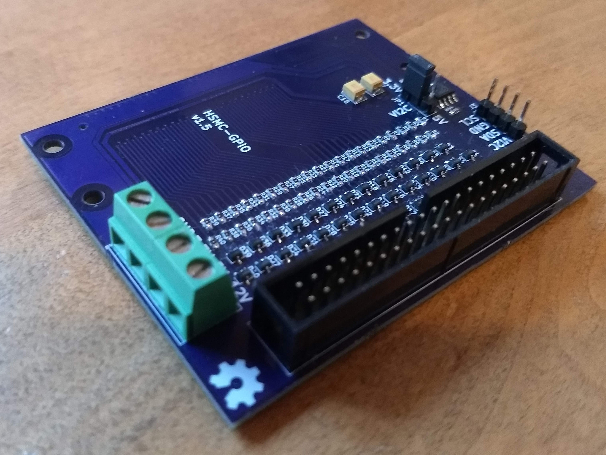
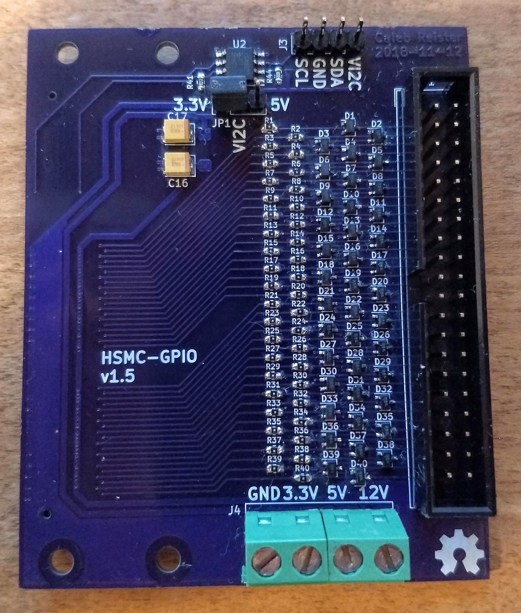
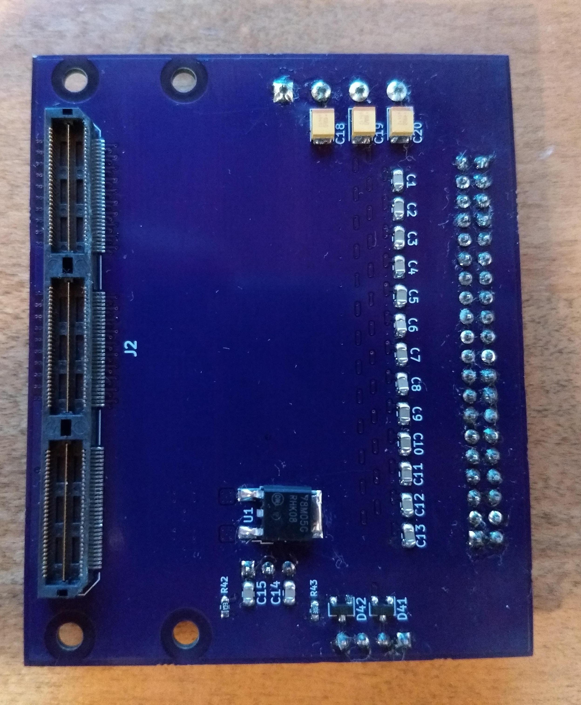
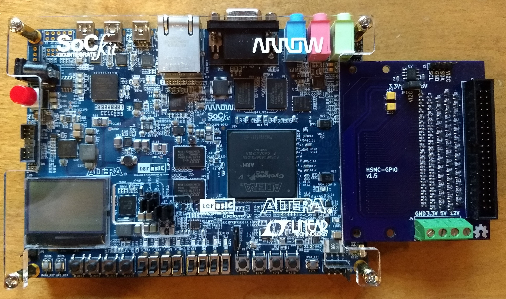
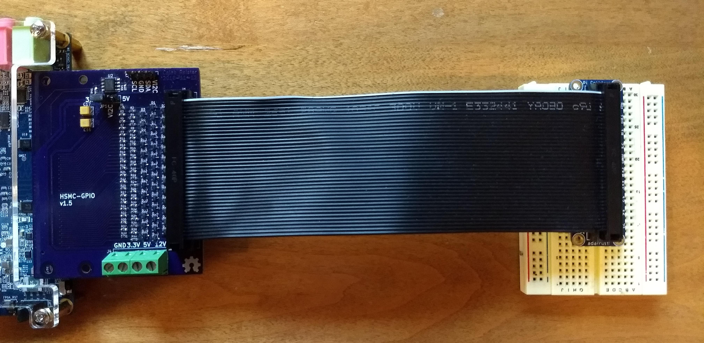

# HSMC-GPIO-kicad

This is a project created to test my new [HSMC Card KiCad footprints](https://github.com/KiCad/kicad-footprints/pulls?page=1&q=is%3Apr+is%3Aopen). It is based loosely on the [Terasis HSTC-GPIO Card](https://www.terasic.com.tw/cgi-bin/page/archive.pl?Language=English&No=322). In small quantities, the cost is comparable to the HSTC-GPIO Card.

## Features
- 40 GPIO pins
- Protection diodes and series resistors
- Power supply terminals
- Buffered I2C port with selectable voltage

## License
 HSMC-GPIO-kicad by <a xmlns:cc="http://creativecommons.org/ns#" href="https://github.com/calebreister/" property="cc:attributionName" rel="cc:attributionURL">Caleb Reister</a> is licensed under a <a rel="license" href="http://creativecommons.org/licenses/by-sa/4.0/">Creative Commons Attribution-ShareAlike 4.0 International License</a>.

## Pictures

